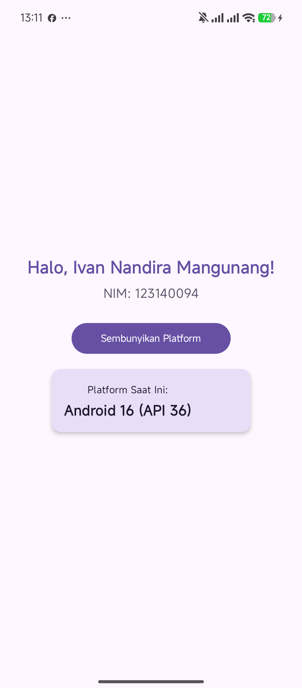
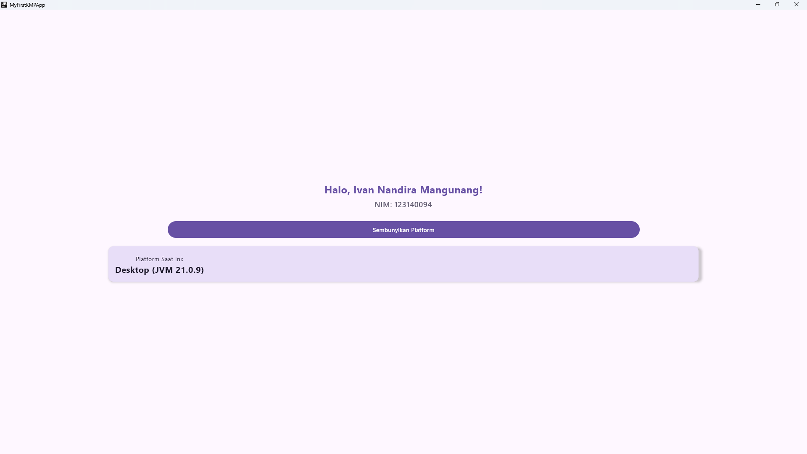

# MyFirstKMPApp

**Nama:** Ivan Nandira Mangunang  
**NIM:** 123140094

---

## Deskripsi Proyek

**MyFirstKMPApp** adalah aplikasi Kotlin Multiplatform (KMP) pertama yang dibangun menggunakan **Compose Multiplatform**. Aplikasi ini menampilkan:

- Sambutan "Halo, Ivan Nandira Mangunang!" 
- NIM: 123140094
- Informasi platform yang sedang digunakan (Android / iOS / Desktop)
- Tombol untuk menampilkan/menyembunyikan informasi platform
- State management menggunakan `remember` dan `mutableStateOf`

### Teknologi yang Digunakan

| Teknologi | Versi |
|-----------|-------|
| Kotlin | 2.0.21 |
| Compose Multiplatform | 1.7.0 |
| Android Gradle Plugin | 8.5.2 |
| Min SDK (Android) | 24 |
| JVM Target | 17 |

### Platform yang Didukung

- Android
- Desktop (Windows / macOS / Linux)
- iOS (stub tersedia, perlu Mac untuk build)

---

### Cara Menjalankan

#### 1. Melalui Android Studio (Rekomendasi)
- **Open Project**: Buka Android Studio, pilih **Open**, lalu arahkan ke folder `MyFirstKMPApp`.
- **Sync**: Tunggu hingga proses *Gradle Sync* selesai.
- **Run Android**: Pilih konfigurasi `composeApp`, pilih emulator/HP, lalu klik **Run (▶)**.
- **Run Desktop**: Buka tab **Terminal** di Android Studio, lalu ketik:
  ```bash
  .\gradlew.bat :composeApp:run
  ```

#### 2. Melalui Terminal / CLI
- **Desktop**:
  ```bash
  .\gradlew.bat :composeApp:run
  ```
- **Android**:
  ```bash
  .\gradlew.bat :composeApp:installDebug
  ```

---

## Struktur Proyek

```
MyFirstKMPApp/
├── composeApp/
│   └── src/
│       ├── commonMain/kotlin/com/example/myfirstkmpapp/
│       │   ├── App.kt          # Shared UI
│       │   └── Platform.kt     # expect declaration
│       ├── androidMain/kotlin/com/example/myfirstkmpapp/
│       │   ├── MainActivity.kt
│       │   └── Platform.android.kt
│       ├── desktopMain/kotlin/com/example/myfirstkmpapp/
│       │   ├── main.kt
│       │   └── Platform.desktop.kt
│       └── iosMain/kotlin/com/example/myfirstkmpapp/
│           └── Platform.ios.kt
├── gradle/
│   └── libs.versions.toml
├── build.gradle.kts
├── settings.gradle.kts
└── gradle.properties
```

---

## Screenshot

| Android | Desktop |
|---------|---------|
|  |  |

---

## Lisensi

Proyek ini dibuat untuk keperluan pembelajaran mata kuliah Pemrograman Aplikasi Bergerak (PAM).
