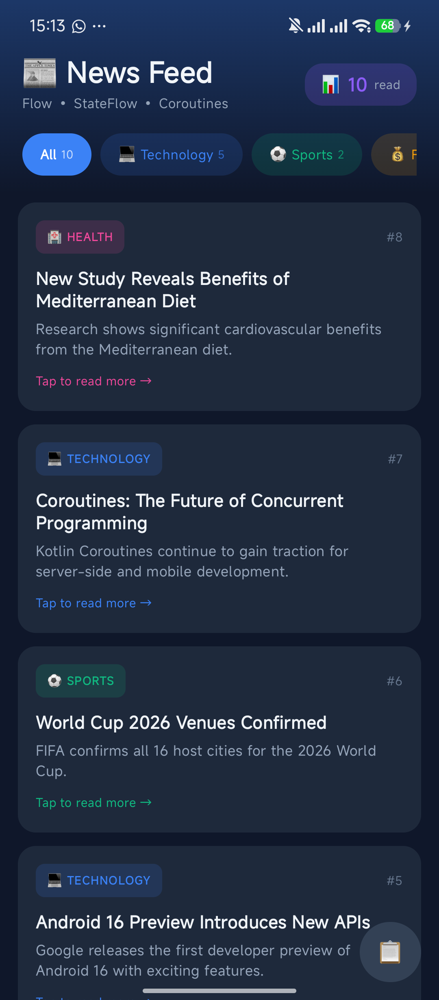
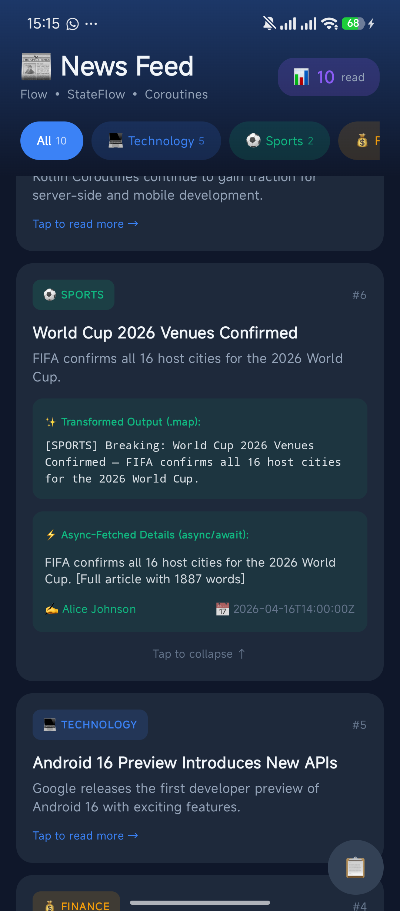
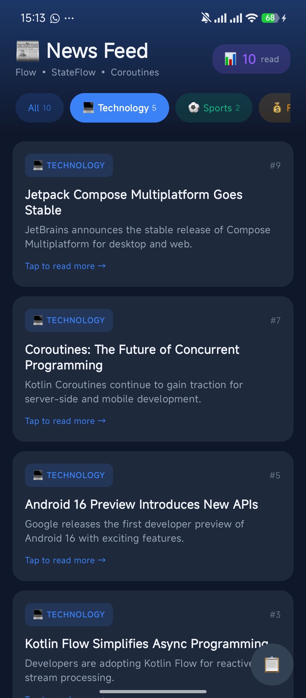
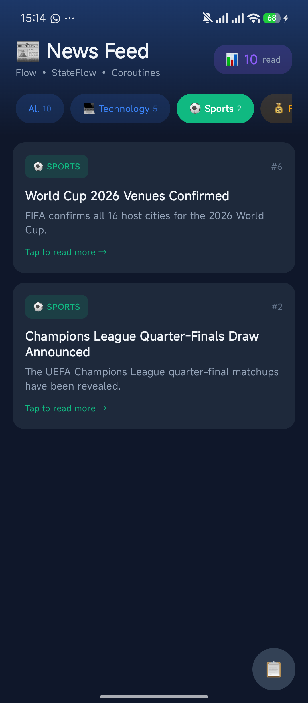
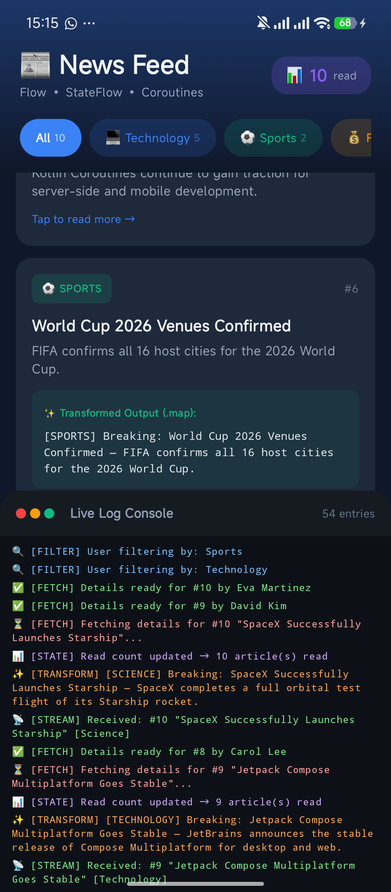

# News Feed Simulator

**Nama:** Ivan Nandira Mangunang  
**NIM:** 123140094  
**Kelas:** RB

News Feed Simulator adalah aplikasi **Compose Multiplatform** yang mensimulasikan aliran berita (news feed) secara real-time. Aplikasi ini dibangun untuk mendemonstrasikan penggunaan **Kotlin Coroutines**, **Flow**, dan **StateFlow** dalam pengembangan antarmuka reaktif dan asinkron.

## Fitur Utama

Aplikasi ini mengimplementasikan berbagai konsep *Asynchronous Programming* modern pada Kotlin:

1. **News Stream (Flow)**
   - Menggunakan `flow { emit() }` untuk menghasilkan aliran (stream) berita baru setiap 2 detik secara terus-menerus.
2. **Filter by Category**
   - Menggunakan operator `.filter {}` untuk menyaring berita berdasarkan kategori yang dipilih pengguna (misal: "Technology", "Sports").
3. **Data Transformation**
   - Menggunakan operator `.map {}` untuk mengubah format berita menjadi string kustom seperti `[TECHNOLOGY] Breaking: ...` sebelum ditampilkan.
4. **State Management (StateFlow)**
   - Menggunakan `MutableStateFlow` dan `StateFlow` untuk melacak dan menampilkan jumlah berita yang telah "dibaca" atau diterima, yang secara otomatis memperbarui *badge* counter pada UI.
5. **Async Detail Fetching (Coroutines)**
   - Menggunakan `async` dan `await` untuk mensimulasikan pengambilan detail berita (seperti nama penulis dan waktu publikasi) dari server secara **concurrent** (paralel) tanpa memblokir Main Thread (UI).
6. **Live Log Console**
   - Panel *built-in* interaktif yang menampilkan log berwarna dari setiap proses di atas (stream, filter, transform, StateFlow update, dan fetching) secara real-time.

## Teknologi yang Digunakan

- **Bahasa Pemrograman**: Kotlin
- **UI Framework**: Compose Multiplatform (Material 3)
- **Concurrency & Reactive Streams**: `kotlinx-coroutines-core` (Coroutines, Flow, StateFlow)
- **Tooling**: Gradle

## Struktur Antarmuka (UI)

- **Dark Premium Theme**: Desain elegan dengan warna gelap dan *gradient*.
- **Category Filter Chips**: Chip horizontal yang dapat di-*scroll* untuk memfilter kategori dengan penghitung jumlah berita per kategori.
- **Expandable News Cards**: Kartu berita yang bisa diklik. Saat di-tap, akan menampilkan hasil transformasi `.map {}` dan hasil *fetching* data tambahan yang dilakukan via metode asinkron.
- **Floating Log Console**: Tombol *floating* di pojok kanan bawah yang akan memunculkan panel log *(slide-up)* untuk proses *debugging* visual.

## Cara Menjalankan

Aplikasi ini dapat dijalankan langsung pada perangkat Android:

1. Pastikan Anda telah menginstal **Android Studio** versi terbaru.
2. Buka folder/direktori proyek ini (`NewsFeedSimulator`) di Android Studio.
3. Tunggu hingga proses **Gradle Sync** selesai secara otomatis.
4. Hubungkan perangkat Android Anda melalui kabel USB (pastikan *Developer Options* dan *USB Debugging* aktif).
5. Pada *toolbar* atas di Android Studio, pastikan modul **`composeApp`** dan nama perangkat Anda telah terpilih.
6. Klik tombol **Run (▶️)** atau gunakan *shortcut* `Shift + F10`.

## Struktur Direktori Penting

Logika utama aplikasi ini dapat ditemukan di `composeApp/src/commonMain/kotlin/`:
- `NewsItem.kt` — Data class untuk struktur item berita dan detailnya.
- `NewsFeedService.kt` — Service layer yang menangani penghasilan *Flow*, pemfilteran, dan transformasi data.
- `NewsRepository.kt` — Repository layer yang menangani StateFlow (penghitung bacaan) dan simulasi HTTP request menggunakan fungsi `suspend`.
- `NewsUI.kt` — File berisi semua komponen Compose UI (layar utama, kartu, filter, panel log).

## Dokumentasi (Screenshot)

| 1. Tampilan Utama | 2. Tampilan Expanded | 3. Tampilan Filter (Tech) |
|:---:|:---:|:---:|
|  |  |  |

| 4. Tampilan Filter (Sports) | 5. Live Log Console |
|:---:|:---:|
|  |  |

---
*Dibuat untuk keperluan pembelajaran Asynchronous Programming menggunakan Kotlin & Compose.*
